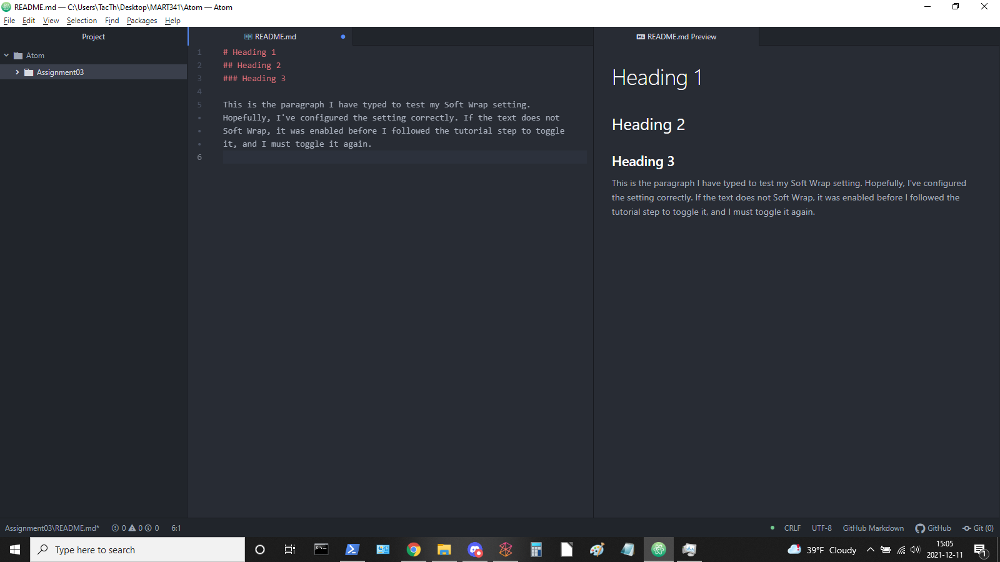

# Assignment 3
## Johnelle DiTonno
### Heading 3

This is the paragraph I have typed to test my Soft Wrap setting. Hopefully, I've configured the setting correctly. If the text does not Soft Wrap, it was enabled before I followed the tutorial step to toggle it, and I must toggle it again.

The next step was to create a URL to a website that I find interesting, so I will show you a web comic that I really enjoy! It's called Wilde Life; it's chock full of literary references, each with a twist of its own, and its artist fosters one of my favorite comment sections on the Internet! The commenters are often witty and clever, as well as kind.

[Wilde Life, Page 1](https://www.wildelifecomic.com/comic/1)

[My Responses](./responses.txt)

Per the Week 3 assignment instructions, a list of 3 things I've learned so far include:
1. How to *italicize* and __bold__ text in Markdown
2. How to create an ordered list and, beyond that:
    + How to create an unordered list
3. How to denote a `snippet of code` in Markdown
