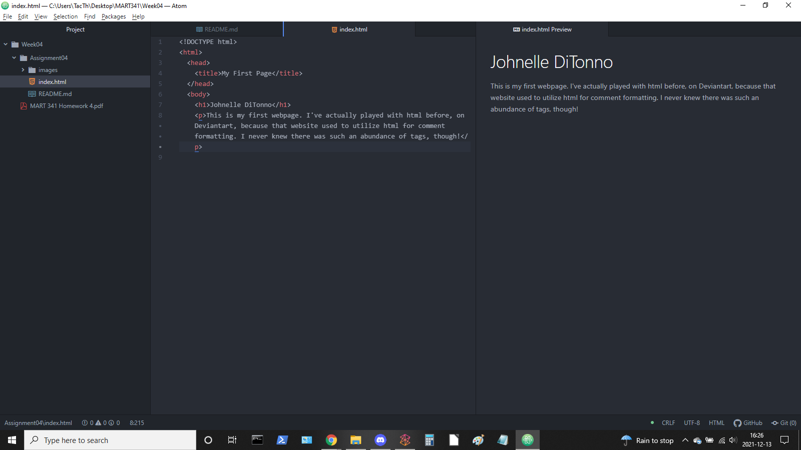

1. Browsers allow users to, well, browse the web for content. The browser essentially acts as a translator for web pages so that the user can visually see what the web page was designed to display. The video provided with this week's material went into detail on how browsers request information, store cookies, and otherwise resolve bad or erroneous html where possible, but overall, the idea is that a browser takes a webpage written in html, xhtml, or other markup language, and converts it into a format that the average user can understand. So far in this course, I've really only used Chrome for my web page development, but that's because I've only been working on assignments. I've been testing in Chrome, Firefox, and Edge for my final project.

2. A markup language is a language that uses tags to define how elements with a document are meant to function. (Important to note: Markup languages are not actually code, or at least that's what was emphasized to me by previous professors.) A common markup language used in development is html, as it is possibly the easiest with which to get started.

